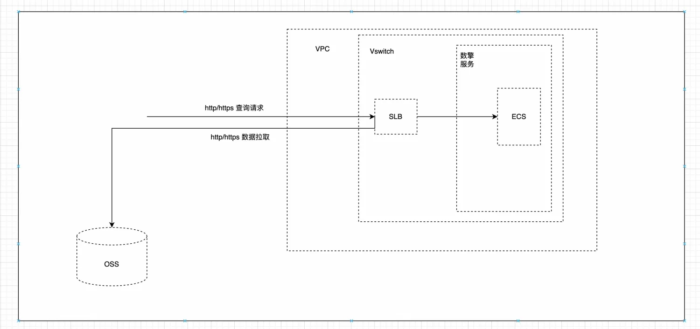

# 概述
天域数擎是以友盟全域数据为基础，提供在线营销服务增强型产品，包括营销标签模型预测分、模型特征定制服务、实时营销增强API，助力企业业务增长。 全域标签增补：预置丰富的全域标签，覆盖基础属性、社会属性、地域分布、兴趣偏好等300+维度，在一方特征不足的情况下，友盟三方数据为企业存量用户补充全域特征，进行人群特征与偏好识别，助力企业用户画像洞察，精细化运营手段，充分满足业务需要。 本文介绍基于计算巢，部署阿里云私域的数擎全量预置数据服务，该服务将提供全域设备（idfa、oaid、手机号）的特征矩阵或兴趣分标签数据的查询功能。

# 实例规格
根据您购买的数据类型选择对应的 ECS 和数据盘配置，此外还需要您提供和 ECS 同 region 的 OSS bucket，用于中转传输数据到 ECS 本地服务数据库。

## 全量预置特征矩阵+ 兴趣分（数据压缩方案）
实例规格：ecs.r7.4xlarge（16 vCPU 128 GiB，内存型 r7 ） ¥2673.49/月 操作系统：Anolis OS 8.4 RHCK 64位 存储：

- 系统盘：ESSD云盘 100GB
- 数据盘：15T（1 个日期分区快照）¥1000/T/月

网络：>=100Mbps，建议 1000Mbps 数据同步时长：10-48h（视网络情况）

## 全量预置特征矩阵（数据压缩方案）
实例规格：ecs.r7.4xlarge（16 vCPU 128 GiB，内存型 r7 ） 操作系统：Anolis OS 8.4 RHCK 64位 存储：

- 系统盘：ESSD云盘 100GB
- 数据盘：10T（1 个日期分区快照）¥1000/T/月

网络：>=100Mbps 数据同步时长：10-36h（视网络情况）

## 全量预置兴趣分（数据压缩方案）
实例规格：ecs.r7.4xlarge（16 vCPU 128 GiB，内存型 r7 ） 操作系统：Anolis OS 8.4 RHCK 64位 存储：

- 系统盘：ESSD云盘 50GB  ¥50/月
- 数据盘：5.5T（1 个日期分区快照）¥1000/T/月

网络：>=100Mbps 数据同步时长：10-24h（视网络情况）

# 部署流程

## 一、准备工作
您需要拥有一个阿里云账号，对 ECS、VPC 、VSWITCH、OSS 、RAM 等资源进行访问和操作。 若您使用主账号，可直接创建服务实例。若您使用RAM用户创建服务实例，且是第一次使用阿里云计算巢，需要在创建服务实例前，对使用的RAM用户的账号添加相应资源的权限。更多信息请参见 [为RAM用户授权](https://help.aliyun.com/zh/ram/user-guide/grant-permissions-to-the-ram-user)。 RAM 账号权限

| 权限策略名称 | 备注 |
| --- | --- |
| AliyunVPCFullAccess | 管理专有网络（VPC）的权限 |
| AliyunECSFullAccess | 管理云服务器服务（ECS）的权限 |
| AliyunROSFullAccess | 管理资源编排服务（ROS）的权限 |
| AliyunComputeNestUserFullAccess | 管理计算巢服务（ComputeNest）的用户侧权限 |

资源准备 除上一步实例规格中所需的 ECS、数据盘、网络等配置，云资源依赖交换机、安全组及相应规则 

## 二、获取部署链接
您可以在阿里云的计算巢中通过MAPPIC关键字进行搜索，也可以单击 [部署链接](https://computenest.console.aliyun.com/service/instance/create/cn-hangzhou?type=user&ServiceId=service-eaf86b94527145059d27) 快速体验。 如果链接显示没有权限，点击诊断查看所需添加的权限策略。

## 三、创建服务实例
进入部署链接后，开始您阿里云账号（UID）下的数擎计算巢服务所需资源配置： 服务实例命名、地域选择、付费类型选按量付费 

ECS 配置（CU、内存选型，建议ecs.r7.4xlarge 规格， 配置不低于该配置），实例密码为 ECS root 账号登录密码，密码勿丢失。可用区 、VPC、交换机等根据实际情况，选择您已存在的实例。 

  点击 立即创建 提交

## 四、查看部署状态
 点击实例 id 查看

点击“资源” 查看，云资源中，资源类型为实例的即本次部署服务的 ECS 实例 

点击 ECS 实例 id 进入，修改安全组策略：入口方向支持 22 端口（ssh 登录）；公网带宽修改为 100Mbps，按量付费 

远程连接 ECS 实例 

密码为创建服务实例时设置的。

进入服务器，查看配置，按接口说明文档，验证接口连通性和数据结果。 

# 计费说明
按查询 id 去重计费。
